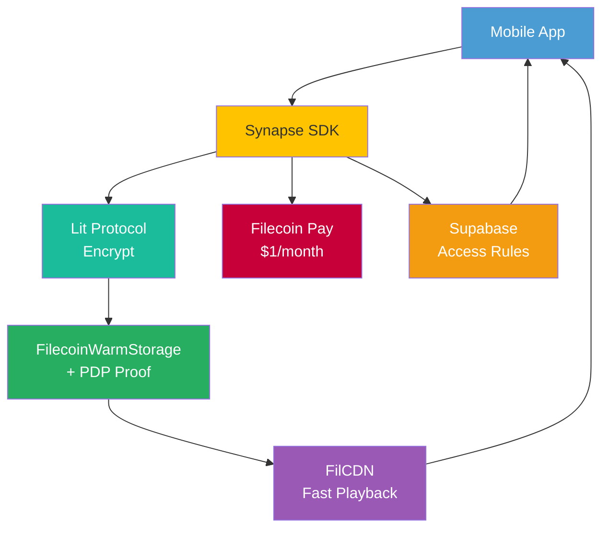

# 🏦 Memory Bank: Your Digital Legacy, Verified & Forever

> **What if your voice could outlive you?**  
> What if your child could hear your laugh — 30 years from now — and know it was *really you*?  
> What if a protest, a war, a moment of joy… could never be erased?

**Memory Bank** is not just storage.  
It’s **digital immortality** — built on **Filecoin Onchain Cloud**.

A permanent, censorship-resistant archive for your photos, videos, voice notes, and stories — where **you own your memories**, **prove they’re real**, and **pass them on** — forever.

> 💬 *"Don’t die with your stories."*

---

## 🌍 The Problem No One Talks About

Every day, irreplaceable human moments vanish:
- A mother’s voice note lost when her phone breaks  
- A protest video deleted by a regime  
- A soldier’s final message, gone with an account  
- A child who never knew their grandparent’s laugh  

We store everything — but **own nothing**.

Google, Apple, Facebook — they can delete, ban, or shut down at will.

There is **no permanent home for human memory**.

Until now.

---

## 💡 The Solution: Memory Bank

Built by **@holyaustin**, Memory Bank is a **global digital legacy platform** that combines:

- 🔍 **SnapTrust Mode**: One-tap "Verify Now" to timestamp and PDP-prove authenticity  
- 💌 **Memory Will**: Auto-share access with heirs when you’re gone  
- 📅 **Time Capsule**: Unlock content in 2030, on a birthday, or at a life event  
- 🌐 **Public Archive**: Contribute to historical collections (e.g., "Ukrainian War Diaries")  
- ⚡ **FilCDN**: Fast playback — no lag, no wait  
- 💳 **Filecoin Pay**: $1/month subscription (USDC or card)  
- 🧩 **Synapse SDK**: Unified interface for storage, payment, retrieval  

No wallet. No seed phrase. Just **phone. social or email login**.

This isn’t Web3 for crypto people.  
This is **Web3 for humanity**.

---

## 🚀 Why This Matters

| User | Memory Bank Gives Them |
|------|------------------------|
| **Parents** | "My child will hear me say 'I love you' — even when I'm gone" |
| **Activists** | "They can’t delete my truth" |
| **Journalists** | "My evidence is tamper-proof" |
| **Families** | "We’ll never lose our history" |
| **You** | "Your story lasts longer than you do" |

> This is the **first app** that turns digital memories into **owned, verifiable, inheritable assets**.

---

## 🧱 How It Works: Built on Filecoin Onchain Cloud



But if you prefer a static view:

🔗 **See full architecture**: [/docs/ARCHITECTURE.png](/docs/diagrams/architecture.pn)

---

## 🌟 Key Features

- ✅ **PDP-Verified Storage** — Tamper-evident, stored on Filecoin  
- ✅ **One-Tap Verification** — Prove your moment is real  
- ✅ **Heir Access** — Share with family after death  
- ✅ **Time Capsule** — Unlock in 2030 or on a life event  
- ✅ **Public Archive** — Contribute to collective history  
- ✅ **Web3-Abstracted** — No crypto knowledge needed  

---

## 📚 Documentation & Design

All design, flow, and business logic is documented for transparency and collaboration:

- 📄 **[Project Overview & Vision](/docs/ABOUT.md)**
- 📐 **[System Architecture](/docs/diagrams/architecture.png)**
- 🧭 **[User Flow (Memory Will)](/docs/diagrams/user_flow.png)**
- 📦 **[Data Lifecycle](/docs/diagrams/data_flow.png)**
- 💰 **[Revenue Model & Sustainability](/docs/revenue-model.md)**
- 💬 **[Feedback to Filecoin Onchain Cloud](/docs/FEEDBACK.md)**

---

## 🛠 Tech Stack

| Layer | Technology |
|------|------------|
| Frontend | React Native, Next.js (RWA) |
| Auth | Web3Auth (email/phone) | Onboard | Privy |
| Encryption | Lit Protocol (client-side) |
| Storage | FilecoinWarmStorage + PDP |
| Payments | Filecoin Pay (USDC, Stripe) |
| Retrieval | FilCDN |
| Dev Interface | Synapse SDK |
| Backend | Supabase (metadata) |

---

## 📦 Installation & Setup

### Prerequisites
- Node.js v22+
- npm or yarn
- Filecoin FVM Testnet access
- Synapse SDK API key ([Get here](https://synapse.filecoin.io))

### Clone & Install
```bash
git clone https://github.com/holyaustin/memory-bank.git
cd memory-bank
npm install
```

### Environment Variables
Create `.env`:
```env
NEXT_PUBLIC_SYNAPSE_API_KEY=your_api_key
NEXT_PUBLIC_FILECOIN_NETWORK=testnet
LIT_CLIENT_KEY=your_lit_key
STRIPE_PUBLIC_KEY=pk_test_...
```

### Run Locally
```bash
npm run dev
# Open http://localhost:3000
```

> 🔍 See `/src/lib/foc.js` for full Filecoin Onchain Cloud integration.

---

## 📎 Project Structure

```
memory-bank/
├── README.md
├── WAVE1.md
├── /docs
│   ├── /diagram
│   │   └── architecture.png
│   ├── revenue-model.md
│   ├── revenue-model.xlsx
│   ├── ABOUT.md
│   ├── ARCHITECTURE.md
│   ├── USER_FLOW.md
│   ├── DATA_FLOW.md
│   └── FEEDBACK.md
├── /frontend
├── /mobile
├── /mmiddleware
└── .env.example
```

---

## 📢 Current Status

> ⚠️ **STILL IN DEVELOPMENT**  
This is a **Wave 1: Product Design** submission.  
No public demo is available yet.  
All diagrams, flows, and business logic are based on technical design and feasibility testing on FVM testnet.

Next steps:
- Build MVP (Wave 2)
- Test PDP verification at scale
- Launch beta with 100 users
- Submit demo video for Wave 2

---

## 🤝 Built by @holyaustin

A solo full-stack developer passionate about **decentralized infrastructure**, **human-centered design**, and **social impact**.

This project is my commitment to building **technology that outlasts us all**.

> 🌐 *"We are not just storing data. We are preserving truth."*

---

## 📄 License  
MIT — Open for collaboration, contribution, and ecosystem growth.
```


